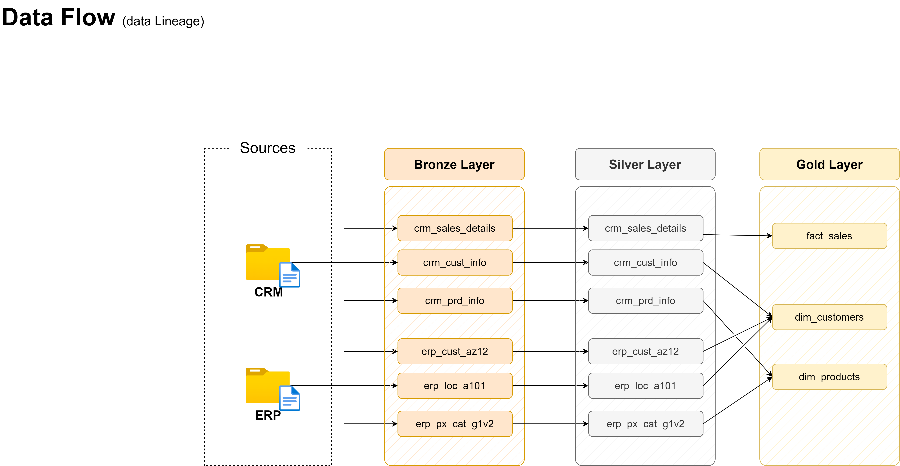

# SQL Data Warehouse Project + Analysis

## **Overview**
This project implements a **Data Warehouse** using the **Medallion Architecture** (**Bronze → Silver → Gold**) to integrate, clean, standardize, and transform CRM and ERP data into **analytics-ready insights**.

The solution provides a robust ETL pipeline, dimensional modeling, and a unified platform for **reporting**, **data analytics**, and future **machine learning** workflows.

Following the creation of the warehouse, you will find a folder of scripts analyzing the data, working on various forms of data analysis such as magnitude, ranking, performance, & change-over-time analyses.

---

## **Project Objectives**
- Ingest raw CRM & ERP datasets into a **centralized SQL Server data warehouse**.
- Apply the **Medallion Architecture** to structure data transformation across three layers.
- Clean, standardize, and normalize data for **business-readiness**.
- Build **fact** and **dimension tables** to support reporting and analytics.
- Ensure **scalability** and **maintainability** for future data sources and BI tools.

---

## **Architecture**


The warehouse follows the **3-layer Medallion Architecture**:

| **Layer**   | **Description**                              | **Object Type** | **Transformations**             |
|------------|--------------------------------------------|-----------------|--------------------------------|
| **Bronze** | Raw, unprocessed data directly ingested from CRM & ERP CSV sources. | Tables | None — full data replication. |
| **Silver** | Cleansed and standardized data ready for business logic. | Tables | Data cleansing, normalization, enrichment. |
| **Gold**   | Business-ready analytics layer optimized for reporting. | Views | Data integration, aggregation, business rules. |

---

## **Data Flow**


- **Source Systems** → CRM & ERP CSV datasets.
- **Bronze Layer** → Raw ingestion via bulk inserts.
- **Silver Layer** → Data cleansing, transformation, and enrichment.
- **Gold Layer** → Dimensional modeling with fact and dimension tables.

---

## **Data Model**


- **Fact Table:** `gold.fact_sales`
  - Contains transactional data like sales, quantities, pricing, and shipping details.
- **Dimension Tables:**
  - `gold.dim_customers` → Customer demographics and attributes.
  - `gold.dim_products` → Product catalog and pricing.
- **Relationships:**
  - `fact_sales` joins to `dim_customers` and `dim_products` via **foreign keys**.

---

## **Data Integration**


The integration process:
- Combines transactional data (`crm_sales_details`) with customer and product info.
- Normalizes inconsistent values like **gender**, **marital status**, and **categories**.
- Ensures referential integrity across CRM and ERP datasets.

---

## **ETL Pipeline**

### **1. Bronze Layer — Raw Data Ingestion**
**Stored Procedure:** `bronze.load_bronze`

Features:
- Bulk inserts CSV data into bronze tables.
- Tracks **load duration** per table and total runtime.
- Includes **print messages** for each step.
- Implements full **error handling**.

```sql
CREATE OR ALTER PROCEDURE bronze.load_bronze AS
BEGIN
    DECLARE @batch_start_time DATETIME = GETDATE();
    DECLARE @start_time DATETIME, @end_time DATETIME;

    BEGIN TRY
        PRINT '==============================';
        PRINT 'Loading Bronze Layer';
        PRINT '==============================';

        -- Example: Load crm_cust_info
        SET @start_time = GETDATE();
        PRINT '>> Truncating Table: bronze.crm_cust_info';
        TRUNCATE TABLE bronze.crm_cust_info;

        PRINT '>> Inserting Data into Table: bronze.crm_cust_info';
        BULK INSERT bronze.crm_cust_info
        FROM 'datasets/source_crm/cust_info.csv'
        WITH (FIRSTROW = 2, FIELDTERMINATOR = ',', TABLOCK);

        SET @end_time = GETDATE();
        PRINT '>> LOAD DURATION: ' + CAST(DATEDIFF(second, @start_time, @end_time) AS NVARCHAR) + ' seconds';
    END TRY
    BEGIN CATCH
        PRINT 'ERROR LOADING BRONZE LAYER: ' + ERROR_MESSAGE();
    END CATCH
END
```

---

### **2. Silver Layer — Data Cleansing & Standardization**
**Stored Procedure:** `silver.load_silver`

Features:
- Cleanses and standardizes CRM and ERP datasets.
- Validates date formats, replaces invalid values, and normalizes categorical fields.
- Enhanced **logging**, **step-wise duration tracking**, and **error handling**.

```sql
CREATE OR ALTER PROCEDURE silver.load_silver AS
BEGIN
    DECLARE @batch_start_time DATETIME = GETDATE();
    DECLARE @start_time DATETIME, @end_time DATETIME;

    BEGIN TRY
        PRINT '==============================';
        PRINT 'Loading Silver Layer';
        PRINT '==============================';

        -- Example: Clean crm_cust_info
        SET @start_time = GETDATE();
        PRINT '>> Truncating Table: silver.crm_cust_info';
        TRUNCATE TABLE silver.crm_cust_info;

        PRINT '>> Inserting Cleaned Data into: silver.crm_cust_info';
        INSERT INTO silver.crm_cust_info
        SELECT
            cst_id,
            cst_key,
            TRIM(cst_firstname),
            TRIM(cst_lastname),
            CASE WHEN cst_marital_status = 'S' THEN 'Single'
                 WHEN cst_marital_status = 'M' THEN 'Married'
                 ELSE 'N/A' END,
            CASE WHEN cst_gndr = 'F' THEN 'Female'
                 WHEN cst_gndr = 'M' THEN 'Male'
                 ELSE 'N/A' END,
            cst_create_date
        FROM bronze.crm_cust_info;

        SET @end_time = GETDATE();
        PRINT '>> LOAD DURATION: ' + CAST(DATEDIFF(second, @start_time, @end_time) AS NVARCHAR) + ' seconds';
    END TRY
    BEGIN CATCH
        PRINT 'ERROR LOADING SILVER LAYER: ' + ERROR_MESSAGE();
    END CATCH
END
```

---

### **3. Gold Layer — Business-Ready Analytics**
- Builds **fact** and **dimension** tables.
- Integrates and aggregates data for reporting.
- Optimized for Power BI and Tableau dashboards.

---

## **Tools & Technologies**
- **Database:** SQL Server
- **ETL:** T-SQL Stored Procedures
- **Architecture:** Medallion (Bronze → Silver → Gold)
- **Data Sources:** CSV datasets from CRM & ERP systems
- **Visualization Ready:** Power BI / Tableau

---

## **Key Features**
- **Automated ETL Pipeline** with zero manual intervention.
- **Process Logging** with per-step and total load durations.
- **Error Handling** with detailed debugging messages.
- **Clean, Standardized Data** across CRM and ERP systems.
- **Analytics-Ready Data Model** for BI and ML.

---

## **Next Steps**
- Automate ETL runs via **SQL Server Agent**.
- Integrate **Power BI dashboards**.
- Extend the model to handle additional source systems.

---

## **Repository Structure**
```
sql-data-warehouse-project/
├── datasets/
│   ├── source_crm/
│   ├── source_erp/
├── procedures/
│   ├── bronze/
│   ├── silver/
│   ├── gold/
├── assets/
│   ├── data_model.png
│   ├── data_architecture.png
│   ├── data_flow.png
│   ├── data_integration.png
├── README.md
```

---

## **Business Impact**
This project delivers a **scalable, analytics-ready data platform** that:
- Centralizes CRM & ERP data.
- Ensures **clean, consistent reporting**.
- Enables actionable insights for marketing, operations, and product teams.

---

## **Author**
**Edward Happle**  
[GitHub Repository](https://github.com/ehapple/sql-data-warehouse-project)

